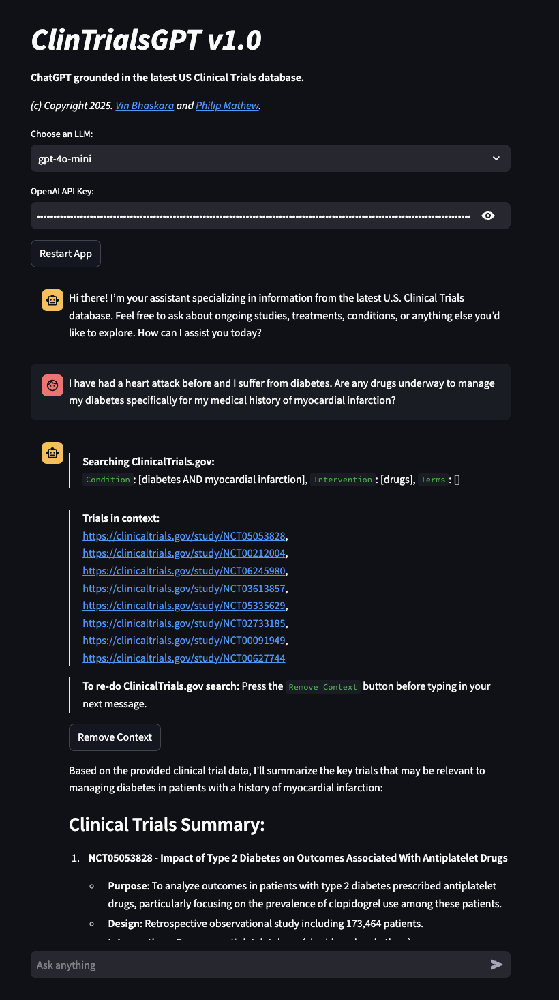

# ClinTrialsGPT v1.0

**Harness the power of LLMs to synthesize and reason over live clinical trial data -— bridging trial evidence and insight in real time!**

*(c) Copyright 2025. [Vin Bhaskara](https://vinbhaskara.github.io/) and [Dr. Philip Mathew, MD](https://www.linkedin.com/in/philipmathewmd/).*

Tl;dr. Quick installation: `docker run -p 8501:8501 vinbhaskara/clintrialsgpt:latest`

Chat just as you would with ChatGPT -- except that any query relevant to clinical trials will trigger an API call to the ClinicalTrials.gov database with relevant search terms inferred from the user's query (i.e. "agentic retrieval"). The responses to queries are grounded in the clinical trial data retrieved with appropriate citations. 

**Docker hub image link:** [vinbhaskara/clintrialsgpt:latest](https://hub.docker.com/r/vinbhaskara/clintrialsgpt)

**Here is an example screenshot:**

## How to run the app?

Find your OpenAI API key by following instructions here: [Link](https://help.openai.com/en/articles/4936850-where-do-i-find-my-openai-api-key)

Two ways to get the app running - 

### 1. Running on Docker

First, install [Docker](https://www.docker.com/). 

#### Pull image and run (easiest and preferred way)

After installing Docker, open the Terminal/Command Prompt and run `docker run -p 8501:8501 vinbhaskara/clintrialsgpt:latest` and that's it! Open [http://localhost:8501/](http://localhost:8501/) and get going!

#### Or, build your own image

Run `docker-compose up --build` to build your own local image, and open [http://localhost:8501/](http://localhost:8501/). Voila!

### 2. Installing on your local machine
After installing the required python packages in `requirements.txt`, run `streamlit run clintrialsgpt.py` and open [http://localhost:8501/](http://localhost:8501/). Add your OpenAI API key and start using!

## Disclaimer

This tool is for informational and educational purposes only. It does not provide medical advice, diagnosis, or treatment. The information is retrieved from publicly available clinical trials data and may be incomplete, outdated, or misinterpreted.

By using this app, you acknowledge that all use is at your own risk. The creators accept no responsibility or liability for any outcomes, decisions, or actions taken based on the information provided.

Always consult a qualified healthcare professional for medical advice.
