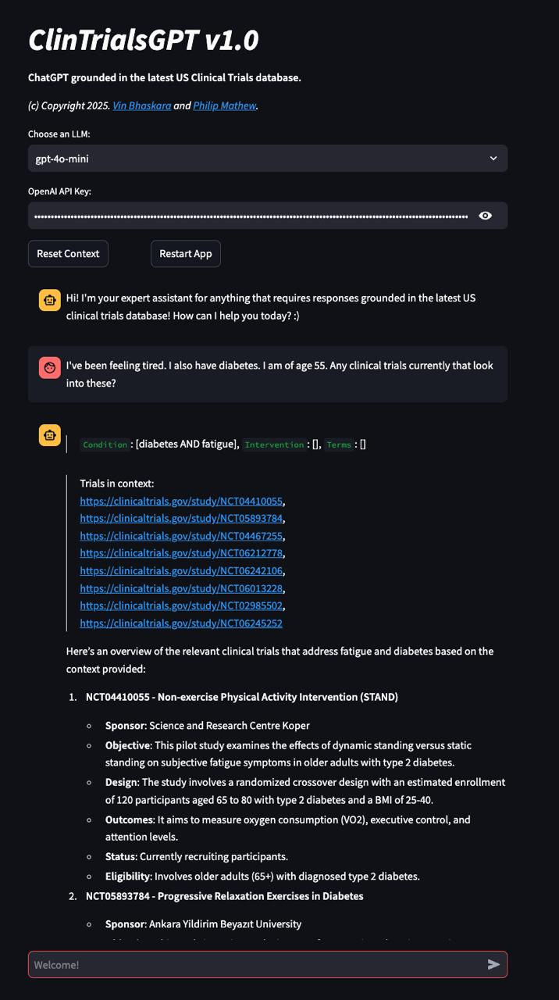

# ClinTrialsGPT v1.0

**ChatGPT grounded in the latest US Clinical Trials database!**

*(c) Copyright 2025. [Vin Bhaskara](https://vinbhaskara.github.io/) and [Dr. Philip Mathew](https://www.linkedin.com/in/philipmathewmd/).*

Chat just as you would with ChatGPT -- except that any query relevant to clinical trials will trigger an API call to the US Clinical Trials database with relevant search terms inferred from the user's query (i.e. "agentic retrieval"). The responses to queries are grounded in the clinical trial data retrieved with appropriate citations. 

Here is an example screenshot:

## How to run the app?

### Installing on your local machine
After installing the required python packages in `requirements.txt`, run `streamlit run clintrialsgpt.py` and open [http://localhost:8501/](http://localhost:8501/). Voila!

## Installing on Docker (preferred)

First, install [Docker](https://www.docker.com/). Then run `docker-compose up --build` and open [http://0.0.0.0:8501/](http://0.0.0.0:8501/). Voila!
